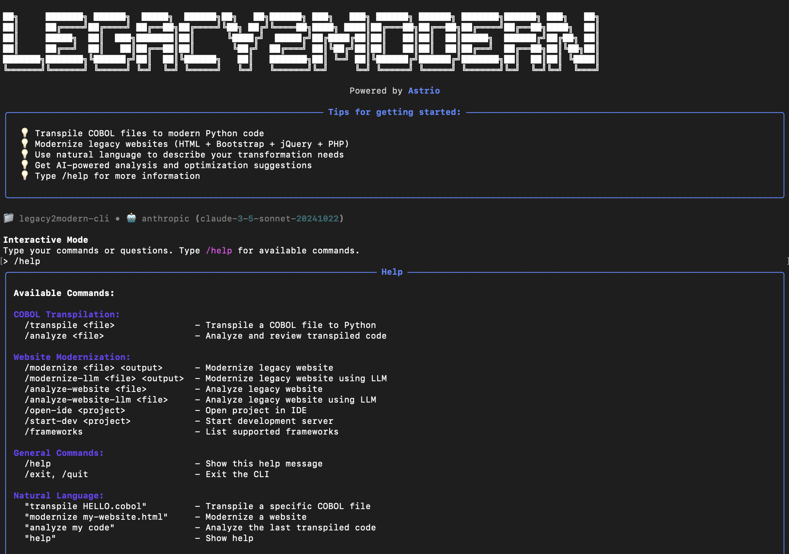

# Legacy2Modern (L2M)

L2M is a local, open-source, and multi-agent AI legacy website modernizer. 

<div align="center">

<!-- Keep the gap above this line, otherwise they won't render correctly! -->
[](https://github.com/astrio-ai/openlegacy) 
[](https://discord.gg/2BVwAUzW)
[](https://github.com/openrewrite/.github/blob/main/CONTRIBUTING.md)
</div>



## 🚀 Features

### **Website Modernization** 🌐
- **Multi-File Support**: Handle entire website codebases, not just single files
- **Multiple Input Types**: GitHub repositories, ZIP archives, local directories, single files
- **Framework Migration**: Convert to React, Next.js, Astro, Vue, Svelte, or Angular
- **Component Extraction**: Identify and extract reusable components
- **Asset Optimization**: Analyze and optimize CSS, JS, and images
- **Navigation Analysis**: Understand site structure and user flows
- **Responsive Design**: Ensure modern responsive layouts
- **SEO Optimization**: Maintain and improve search engine optimization

### **AI-Powered Analysis**
- **Claude Integration**: Advanced LLM analysis for complex transformations
- **Intelligent Recommendations**: Personalized modernization strategies
- **Risk Assessment**: Identify potential issues and mitigation strategies
- **Performance Insights**: Analyze and optimize for modern standards

## 📦 Installation

### Quick Install
```bash
curl -sSL https://raw.githubusercontent.com/astrio-ai/legacy2modern/main/install.sh | bash
```

### Manual Install
```bash
pip install legacy2modern
```

### Development Install
```bash
git clone https://github.com/astrio-ai/legacy2modern.git
cd legacy2modern
pip install -e .
```

## 🎯 Quick Start

### Modernize a Website
```bash
# GitHub repository
legacy2modern website https://github.com/nolan-lwin/Personal-Portfolio output/react-website

# Local directory
legacy2modern website ./legacy-website/ output/react-website

# ZIP archive
legacy2modern website website-backup.zip output/react-website

# Single HTML file (for backward compatibility)
legacy2modern website index.html output/react-website
```

### Interactive Mode
```bash
legacy2modern
# Then use natural language commands:
# "Modernize https://github.com/nolan-lwin/Personal-Portfolio to React"
# "Convert this legacy site to Next.js"
# "Analyze https://github.com/user/repo"
```

## 🌐 Enhanced Website Modernization

Legacy2Modern supports **entire website codebases** with intelligent multi-file analysis and **GitHub repository handling**:

### **Supported Input Types**

#### 1. **GitHub Repository** 🐙
```bash
# Modernize a GitHub repository
legacy2modern website https://github.com/nolan-lwin/Personal-Portfolio output/react-website

# Analyze without modernizing
legacy2modern analyze https://github.com/user/legacy-website
```

**Features:**
- Automatic repository cloning
- Project structure analysis
- Metadata extraction (package.json, README)
- File categorization and dependency mapping
- Support for public repositories

#### 2. **Local Directory** 📂
```
legacy-website/
├── index.html          # Homepage
├── about.html          # About page
├── services.html       # Services page
├── contact.html        # Contact page
├── css/
│   ├── style.css       # Main stylesheet
│   └── bootstrap.css   # Bootstrap framework
├── js/
│   ├── main.js         # Main JavaScript
│   └── jquery.js       # jQuery library
└── images/
    ├── logo.png        # Logo image
    └── hero.jpg        # Hero image
```

#### 2. **ZIP Archive** 📦
```bash
legacy2modern website website-backup.zip output/modern-website
```

#### 3. **Git Repository** 🔗
```bash
legacy2modern website https://github.com/user/legacy-website output/modern-website
```

### **Supported Output Frameworks**

#### **React** ⚛️
- Modern functional components with hooks
- Responsive design with Tailwind CSS
- Optimized performance and SEO
- Component-based architecture

#### **Next.js** 🚀
- Server-side rendering (SSR)
- Static site generation (SSG)
- API routes for backend functionality
- Built-in optimization features

#### **Astro** ⭐
- Multi-framework support
- Zero JavaScript by default
- Excellent performance
- Modern static site generation

## 🔧 Advanced Features

### **Component Analysis**
- Automatic detection of reusable UI patterns
- Extraction of common elements (headers, footers, navigation)
- Smart component naming and organization

### **Asset Optimization**
- CSS minification and optimization
- JavaScript bundling and tree-shaking
- Image optimization and responsive variants
- Font loading optimization

### **Navigation & Routing**
- Automatic route generation
- Navigation menu extraction
- Breadcrumb generation
- Sitemap creation

### **SEO & Accessibility**
- Meta tag preservation and enhancement
- Semantic HTML structure
- Alt text for images
- ARIA labels and roles

## 📁 Project Structure

```
legacy2modern/
├── engine/
│   ├── agents/           # AI agents for analysis
│   ├── cli/             # Command-line interface
│   ├── functionality_mapper/  # Functionality mapping
│   └── modernizers/
│       └── static_site/  # Website modernization engine
├── examples/
│   └── website/         # Example websites
├── tests/
│   └── static_site/     # Website modernization tests
└── docs/               # Documentation
```

## 🧪 Testing

Run the test suite:

```bash
pytest
```

Run specific website modernization tests:

```bash
pytest tests/static_site/
```

## 🤝 Contributing

We welcome contributions! Please see our [Contributing Guide](CONTRIBUTING.md) for details.

## 📄 License

This project is licensed under the Apache License 2.0 - see the [LICENSE](LICENSE) file for details.

## 🙏 Acknowledgments

- Built with [Claude AI](https://claude.ai) for intelligent analysis
- Powered by modern web frameworks and tools
- Community-driven development and feedback
